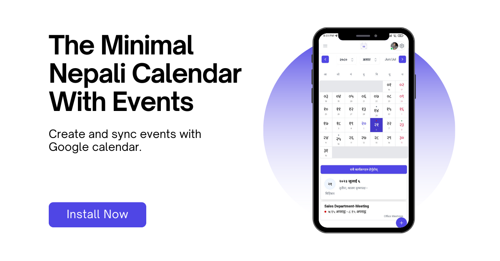

# Miti - The Nepali Calendar 

This version of Miti is an open source progressive web app that allows you to view and sync events with Google Calendar. 
Check live version of this application at [https://miti.bikram.io](https://miti.bikram.io).

Miti is a minimal Nepali Calendar App that can sync with your Google account and can be installed on any operating system as a progressive web app. 

It is completely open-source and free to use without any ads. But why did we create yet another Nepali Calendar App when there are already so many of them? Two main reasons, they’re too bloated and they fail to become a good calendar, i.e. to cross-compatibility with other calendars. Miti can be operated in sync with native calendar apps in any OS because almost all of them support google calendar. 

## Contributing

We welcome contributions from everyone. Please check out our [contributing guidelines](./CONTRIBUTING.md) for more information.